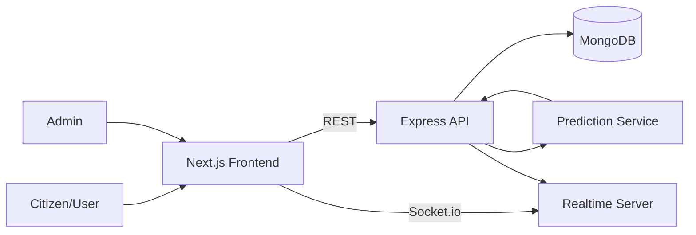

# SmartQueue - AI-Powered Virtual Queue Optimization System

SmartQueue is a production-ready full-stack SaaS platform for optimizing queues in hospitals, banks, and government offices.

## Why This Project Is Interview-Ready
- Real full-stack architecture (Next.js + Express + MongoDB)
- Practical AI logic for wait prediction and crowd guidance
- Role-protected admin analytics endpoints
- Realtime updates via Socket.io
- Tested core prediction logic (backend unit tests)
- Deployment-ready with environment-driven configuration

## Live Capabilities
- Join virtual queue
- Dynamic token generation (`HSP-0001`, `BNK-0001`, etc.)
- AI wait-time prediction:
  - `wait = queue length x avg service time x historical factor`
- Intelligent messages:
  - `Low crowd now`
  - `Moderate traffic`
  - `High traffic expected. Best time to visit: 11 AM`
- Admin dashboard with:
  - total users in queue
  - average waiting time
  - queue growth trend
  - weekly trends
  - peak-hour heatmap
- Bonus:
  - realtime queue events
  - QR token output
  - loading skeletons

## Tech Stack
- Frontend: Next.js (App Router), Tailwind CSS, Recharts
- Backend: Node.js, Express, Mongoose, Socket.io
- Database: MongoDB Atlas/local MongoDB

## Architecture


## Folder Structure
```text
smartqueue/
  backend/
    src/
      app.js
      server.js
      config/db.js
      middleware/adminAuth.js
      models/QueueEntry.js
      routes/queue.routes.js
      routes/analytics.routes.js
      services/prediction.js
    tests/prediction.test.js
    .env.example
    package.json
  frontend/
    app/
      page.tsx
      dashboard/page.tsx
      about/page.tsx
      layout.tsx
      globals.css
    components/
    lib/
    scripts/
    .env.example
    package.json
  render.yaml
```

## API Endpoints
Base: `http://localhost:4000`

### Queue
- `POST /api/queue/join`
- `GET /api/queue/list`
- `GET /api/queue/predict`
- `PATCH /api/queue/:id/serve` (admin-protected)
- `PATCH /api/queue/:id/done` (admin-protected)

### Analytics (admin-protected)
- `GET /api/analytics/overview`
- `GET /api/analytics/trends`

Admin protection uses header:
- `x-admin-key: <ADMIN_API_KEY>`

## Environment Variables

### Backend (`backend/.env`)
```bash
PORT=4000
MONGODB_URI=mongodb://127.0.0.1:27017/smartqueue
CLIENT_ORIGIN=http://localhost:3000
ADMIN_API_KEY=change-this-admin-key
```

### Frontend (`frontend/.env.local`)
```bash
NEXT_PUBLIC_API_URL=http://localhost:4000
```

## Local Run

### 1) Backend
```bash
cd smartqueue/backend
npm install
npm run dev
```

### 2) Frontend
```bash
cd smartqueue/frontend
npm install
npm run dev
```

Frontend: `http://localhost:3000`
Backend: `http://localhost:4000`

## Test & Build Status

### Backend tests
```bash
cd smartqueue/backend
npm test
```
Current result: **4/4 tests passing**.

### Frontend production build
```bash
cd smartqueue/frontend
npm run build
```
Current result: **build passes**.

## Deployment Guide

## Backend (Render or Railway)
1. Create service from repo path `smartqueue/backend`
2. Build: `npm install`
3. Start: `npm start`
4. Set env vars: `MONGODB_URI`, `CLIENT_ORIGIN`, `ADMIN_API_KEY`

## Frontend (Vercel)
1. Import repo path `smartqueue/frontend`
2. Set env: `NEXT_PUBLIC_API_URL=<backend-url>`
3. Deploy

## Interview Demo Script (2-3 min)
1. Open Home page and join queue
2. Show generated token + predicted wait + AI suggestion
3. Open Dashboard and enter admin key
4. Show metrics, trend charts, and peak-hour heatmap
5. Explain prediction formula and scalability path (multi-branch tenancy)

## Production Hardening Next Steps
- JWT auth + RBAC instead of static admin key
- Rate limiting + request validation
- E2E tests (Playwright)
- Notification integrations (SMS/WhatsApp)
- Audit logs and tenant-level analytics
